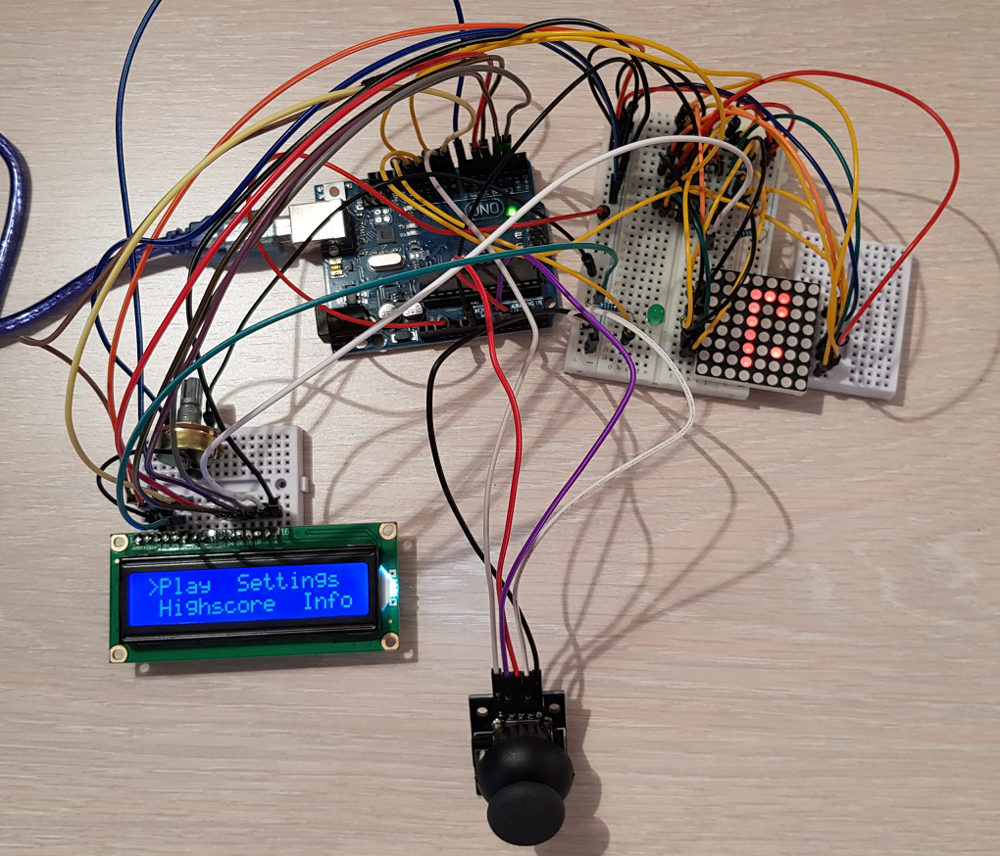

# Matrix game project
## Name of the game: Snake
### Description
The main purpose of the game is to make the snake eat as many food points as possible, represented by lighting pixels on the matrix. The snake can eat only one food point at a time, and this is the only way to increase the score. As long as the snake eats more food, it will become more and more bigger, and it will be harder for the player to control it. The player has the liberty to choose the starting level for the game. A demo video can be found here: https://www.youtube.com/watch?v=QjxU2AV5-y0

### Hardware components
For realizing this project, I have used the following hardware components: 
Arduino UNO board 
8x8 LED matrix - the game itself is displayed here 
1 breadboard and 1 mini-breadboard
LCD - used for the game menu, that displays the score, the number of lives, the settings and some information about the game  
Joystick - used to control how the snake is moving 
MAX7219 Driver 
Potentiometer - to let the player set the intensity of the LCD screen  
LED - to be lighten up when the snake eats something 
Wires - to connect all the pieces together

### How to play
The goal of this game is to make the snake bigger by helping him eat as many food points as possible.There is no time limit, the player can play as long as he still has at least one life left. A food point is a lit point, randomly displayed on the matrix and it needs to be touched by the head of the snake in order to be eaten. As long as the snake gets bigger, it will be harder for him to eat the points without his head touching one part of his body. The player is allowed to move the snake through the 4 edges of the matrix, but is not allowed to let the snake eat himself, so his head must not touch the rest of his body. In case this happens, one life is lost. The player has 3 lives. There are 3 levels: 
Level 1: the snake moves naturally, without speed 
Level 2: the speed increases 
Level 3: the speed increases and the food is changing its position every 2 seconds 
The score gets higher everytime the snake eats a food point, this being the only way the player can increase the score. If the snake doesn't eat the current food point, the score won't increase. Depending on which level is the player curerntly playing, one food point can bring more or less points (a food point brings some points when eaten at level 1, but eaten on level 2 brings more points, and evem more when eaten on level 3).
