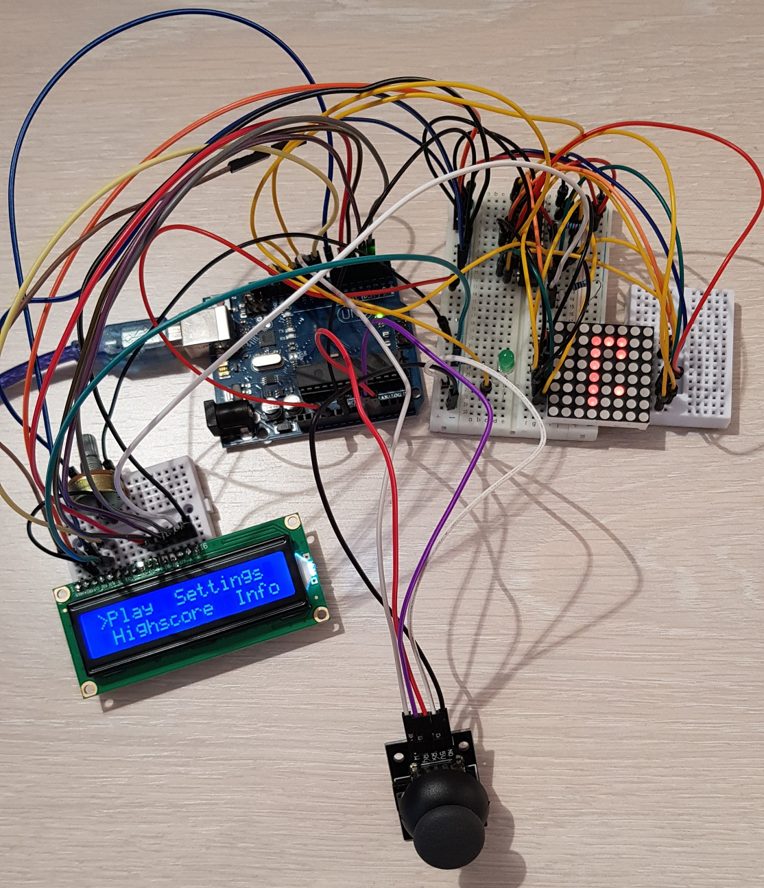

# Matrix game project
## Name of the game: Snake
## Description
The main purpose of the game is to make the snake eat as many food points as possible, represented by lighting pixels on the matrix. The snake can eat only one food point at the time, and can't go further without eating the current one. 

## Tehnical features
### Hardware components
For realizing this project, I have used the following hardware components: 
Arduino UNO board 
8x8 LED matrix - the game itself is displayed here 
1 breadboard and one mini-breadboard
LCD - used for the game menu, that displays the score, the number of lives, the settings and some information about the game  
Joystick - used to control how the snake is moving 
MAX7219 Driver 
LED - to be lighten up when the snake eats something 
Wires - to connect all the pieces 

### Game specifications
The score is incremented each time the snake eats a food point. In the first level, the score is incremented by 1 each time the snake eats a food point. In the next level, the speed is increasing so it's harder and harder to eat the food points.
On level 3, the last level, the food points are changing its positions, at every 2 seconds. Having the points teleporting makes it even harder for the snake to catch them.
There is only way to lose one life: the snake eats himself, this means that the head of the snake meets one part of his body. The player has 3 lives.

### How to play
The goal of this game is to make the snake bigger by helping him eat as many food points as possible.There is no time limit, the player can play as long as he still has at least one life left. A food point is a lit point, randomly displayed on the matrix and it needs to be touched by the head of the snake in order to be eaten. As long as the snake gets bigger, it will be harder for him to eat the points without his head touching one part of his body. The player is allowed to move the snake through the 4 edges of the matrix, but is not allowed to let the snake eat himself, so his head must not touch the rest of his body. In case this happens, one life is lost. The player has 3 lives. There are 3 levels: 
Level 1: the snake moves naturally, without speed 
Level 2: the speed increases 
Level 3: the speed increases and the food is changing its position every 2 seconds

### The lcd menu
The lcd screen will display a game menu, with 3 available options that can be selected: Play, Settings, Highscore and Info.
Play- if selected, it will start the game
Highscore- the highscore is updated when the game is done
Settings- the player can set the starting difficulty of the game, or the contrast value for the lcd display
Info- contains the name of the game, the name of the creator, and the github link
While playing, the lcd display will show the current level, the score, updated when it needs, and the number of remaining lives.
When the game is over, the lcd display will show the following options: Play again(in order to play again the game), Home(it goes back to the main menu), Info(it shows the relevant information about the last game played: score/highscore, level).
